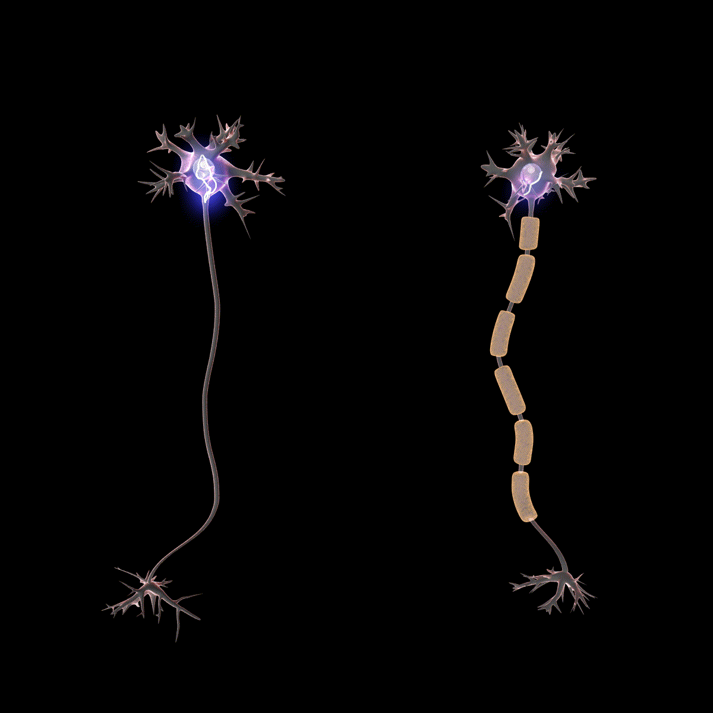

# Neuroscience

### Summary:

Primarily I'm interested in neuroplasticity and the brains capacity to heal from trauma
and thrive through adversity. 

### concepts:

Myelination - the brain literally changes to adapt with the environment.

Neuroplasticity - Your brain can in some ways rewire itself which helps you learn through life. 
How you spend your time and attention determines how your brain will change over time.

### books:

[The Brain that Changes itself](https://www.goodreads.com/book/show/570172.The_Brain_that_Changes_Itself)

### Images:

