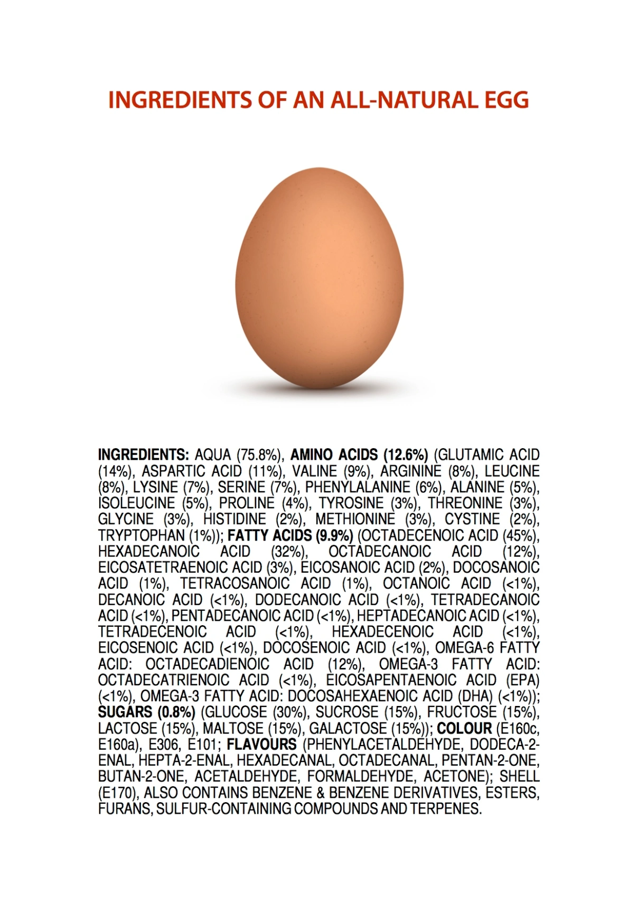
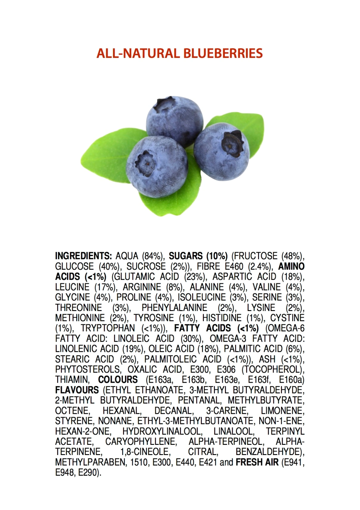
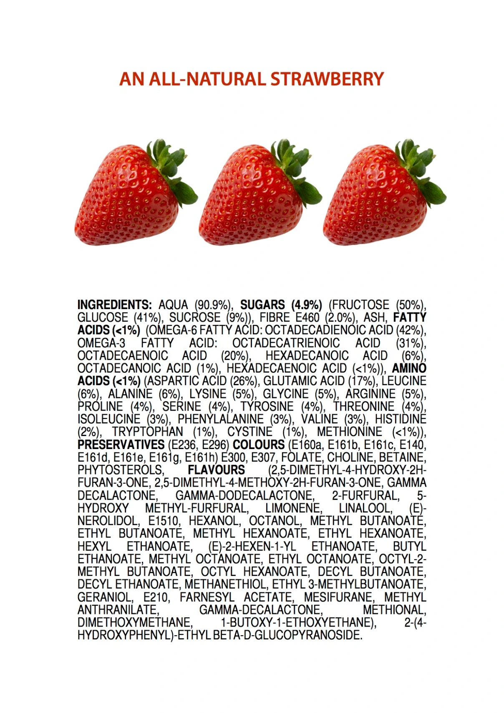

# Nutrition

## Summary: 

The multivitamin myth: You will be healthy if you just have a good multivitamin and basic macronutrients.

## Wiki:

## Photos:

Photos are from: [Ingredients of nautral foods](https://jameskennedymonash.wordpress.com/)

## Links:

[Ingredients of nautral foods](https://jameskennedymonash.wordpress.com/)

## Books:

## People:

