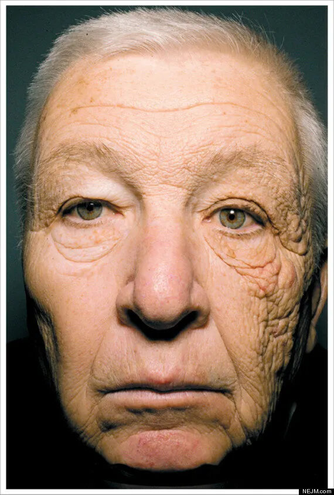
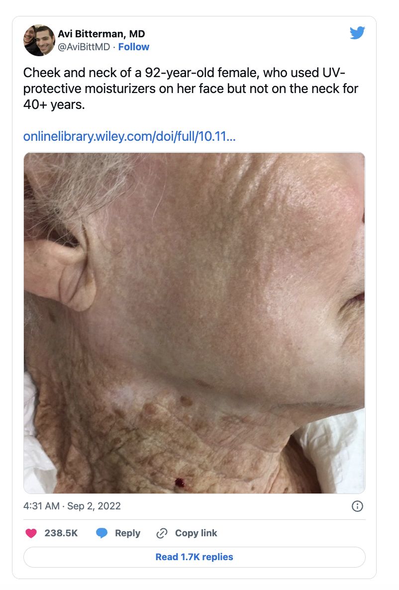
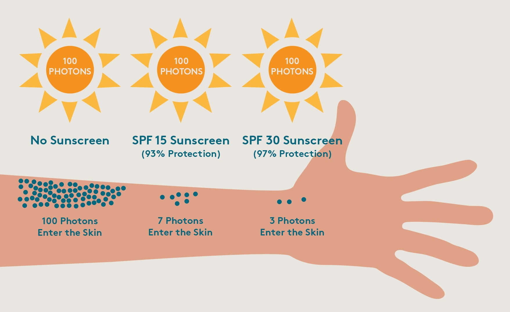

# Sunlight exposure

### Summary:

Sunlight exposure is critical for optimal human functioning. 

### Key benefits

* Enables Vitamin D synthesis
* Can significantly improve psychological wellbeing (see for example Seasonable Affective Disorder SAD)
* Helps to balance circadian rhythm (i.e. day night cycles, as darkness releases melatonin)

### The key downsides are:

* Causes accelerated photoaging (essentially aging your skin)
* Increase risk of Skin cancer

### Photoaging examples:

Description for the image below:

`ultraviolet A (UVA) rays transmitted through the window of his delivery truck have severely damaged the skin on the left side of his face during the 28 years he has spent driving on the job.`

### Sunscreen:

SPF 15+ is recommended. SPF 15 means that only one out of 15 photons from the sun will enter the skin. And 
SPF 30 means that only 1 out of 30 will, etc.

### Conclusion:

Some sunlight is beneficial. From my brief reading about 20 minutes a day of direct sunlight is advisable. 
However this may be more depending on your skin colour as people with darker skin have a natural sun protection so 
they generate less vitamin D in the same time.

Despite that the sun causes photo aging and increases cancer risk there are also benefits that can't simply be gained from taking a Vitamin D 
Supplement. So it's advisable for mental health reasons to at least ensure a moderate exposure. For a more accurate figure you 
would have to research more online.

### Wiki:

[Man with sun exposure on one side of face](https://www.huffpost.com/archive/ca/entry/bill-mcelligott-delivery-truck-driver-has-severe-sun-damage-on_n_1573546)

[Woman who used sunscreen on face](https://www.scmp.com/lifestyle/fashion-beauty/article/3191799/photo-showing-40-years-sun-damage-went-viral-showing-what)

