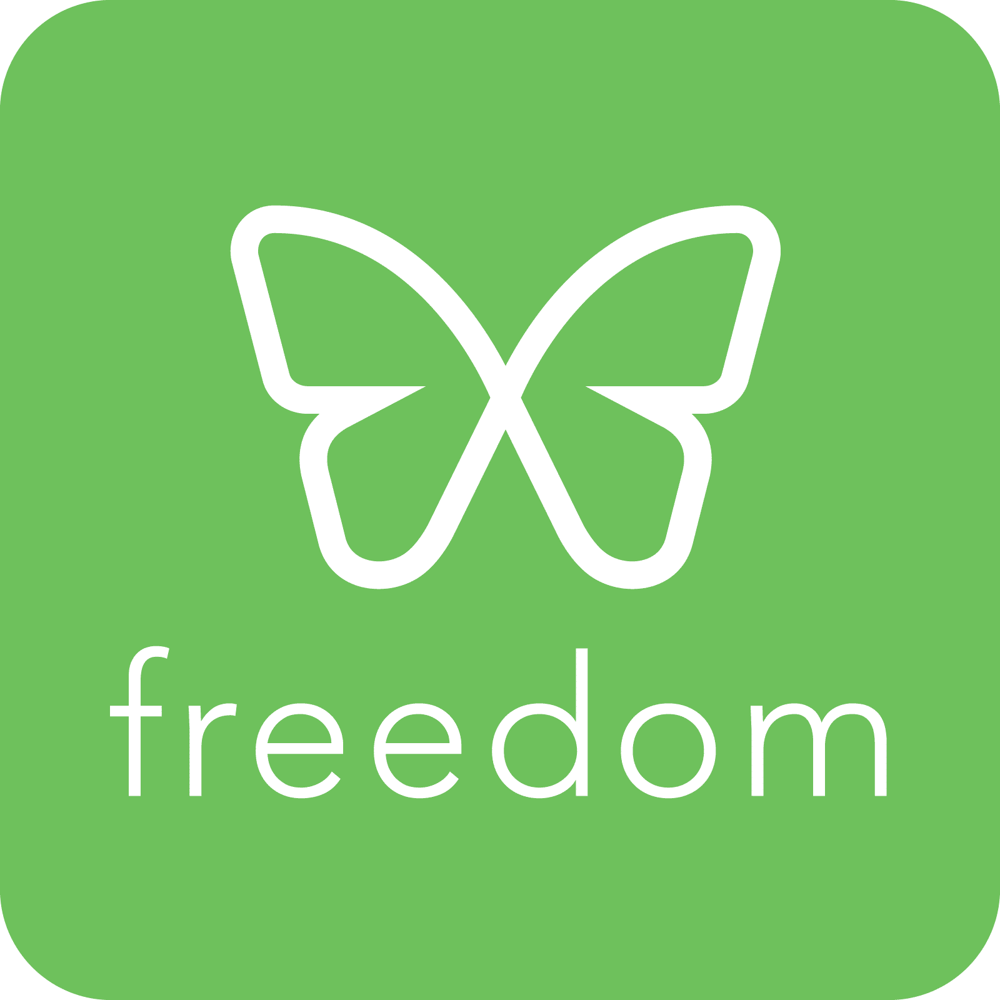

# technology addiction

My philosophy here is to `fight technology with technology`. 

Clearly for anyone who has dealt with this problem will have realise many times over
that willpower alone is not enough. 

### Harms of technology addiciton

* Social isolation
* Lack of career progression
* Sleep disorders
* 

### Process to improve tech addiction

Everyone will have a different process. My process involves:

* Planning ahead of time (pre-commitment)
* Using software / website blockers (i.e. to block youtube, reddit, social media)
* Using Focusmate (or Pomodoros, such as `Forest app`)
* Switching off from low value tasks (such as football, sports, music, films, video games)
* Having clear goals in mind for your day
* A regular meditation practice
* Small and regular rewards for good behaviour. i.e. every 50 minutes (1 pomodoro) of work I do I `pay myself` £10 and 5 minutes.

# Software

[Focusmate](https://www.focusmate.com/)

[Freedom](https://freedom.to/)

