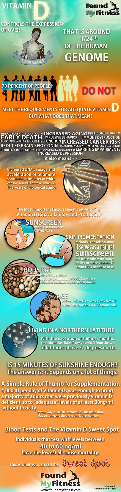

# Vitamin D

### Summary: 

Vitamin D - proven health benefits at minimal cost. Many people in northern climates 
or those who spend time online have a deficiency.

### Conclusion:

Take Vitamin D if you live in a northern climate.

### Videos:

[Vitamin D](https://www.youtube.com/watch?v=tBSfIckPV44)

### Articles:

[Vitamin D deficiency may increase risk of dementia and stroke](https://www.health.harvard.edu/mind-and-mood/low-vitamin-d-levels-may-increase-odds-of-dementia)

### Infographic:

