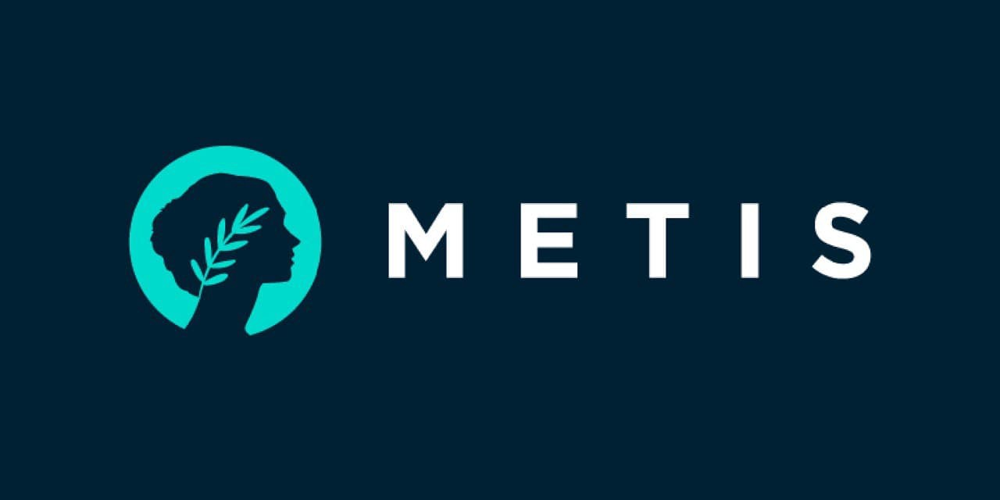
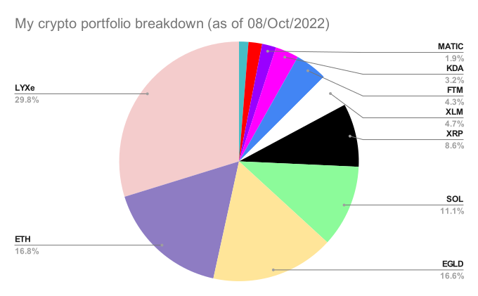

# Cryptocurrency

## Summary:

Cryptographic currency. Potentially a remedy for government controlled [Fiat](https://www.investopedia.com/terms/f/fiatmoney.asp) currency.

Part of the reason inflation is sky high is due to government monetary policies and central banks. Due to quantitative easing 
And the constant [printing of money](https://fred.stlouisfed.org/series/M2SL) without any corresponding assets.

## Which coins should I buy according to you?:

The general advice is to buy when you hear phrases like '1 year low', rather than buy when it's at 'all time high'.
If you start hearing 'all time high' then it's probably time to sell.


The safest coins (most likely to be around in 10 years). Lower returns but less risk.
```
Bitcoin
Ethereum
```

I think having been in the market a long time that for most people it's probably better to play it safe and keep the 
majority of your holdings in Bitcoin and Ethereum. Personally I don't like Bitcoin because of its ridiculous energy usage, 
so I haven't bought any myself.

More risky coins that have huge communities or ecosystems that will probably still be around:
```
Solana (SOL)
Cardano (ADA)
Ripple (XRP)
```

## Potentially also good but highly risky 
Very high risk, very high reward.
```
Lukso (LXYe)
MetisDao (METIS)
```

Lukso:


Metis:



## My current crypto assets by %:

I am quite risk tolerant here. I accept a high level of risk by investing in smaller projects for the chance of higher potential rewards. 
I don't have that much money invested so buying up BTC in hopes of a 2* return is less interesting than buying XRP or SOL in hope of a 10*, 
or buying Lukso (LYXe) in hope of a 100* return.

If I was putting in big money then I'd probably buy more Ethereum and play it safe. I think BTC will have problems with 
climate regulations and most likely banning mining in the next few years, so I'm not that bullish on it. It's not a club 
I want to be a part of.

Generally I prefer L1 proof-of-stake blockchains, and as you can see almost every coin I own fits that criteria. 
MATIC and METIS are exceptions. MATIC is easily the biggest L2, and METIS is a longshot I'm happy to take a risk on.

The only Proof-Of-Work chain I own is Kadena. Primarily because it's the only scalable Proof-of-work coin so the climate impact is LESS BAD 
(Although still unreasonably bad), and the marketcap is very low
so it has a huge potential in the next bull market. I don't like to support PoW coins due to climate concerns, but KDA has so much potential 
at this price that it's hard to ignore.



## Articles:

[Speculative bitcoin Adoption / price theory](https://medium.com/@mcasey0827/speculative-bitcoin-adoption-price-theory-2eed48ecf7da)

### Concepts:
```
staking,
Proof of Work,
Proof of Stake,
dPOS - delegated proof of stake
POAP - Proof of Attendance protocol
Layer 1
Layer 2
```

### Acronyms:
```
BTFD - Buy The Fucking Dip
DYOR - Do Your own Resarch
FUD - Fear, Uncertainty, Doubt
FOMO - Fear Of Missing Out
HODL - Hold On for Dear Life
WAGMI - We're All Gonna Make It
NGMI - Not Gonna Make It
```

#### Youtube Channels:

Both of these are pretty good for finding about new coins.

[CoinBureau](https://www.youtube.com/c/CoinBureau/videos)

[Coinsider](https://www.youtube.com/c/Coinsider/videos)

[CryptosRus](https://www.youtube.com/c/CryptosRUs/videos)

