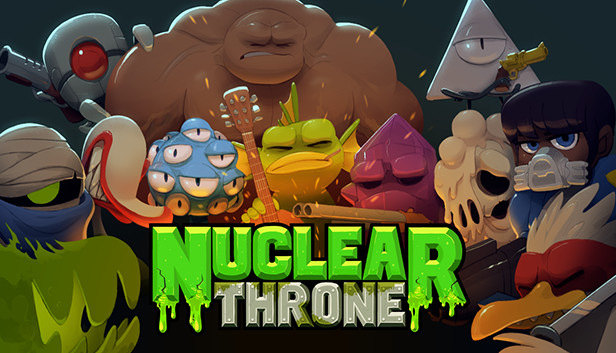
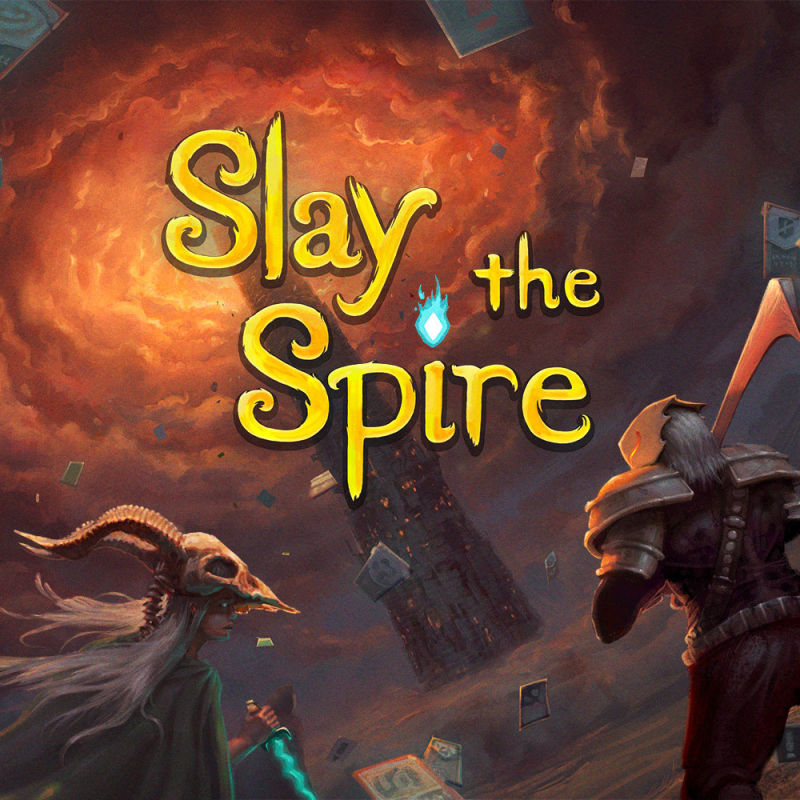
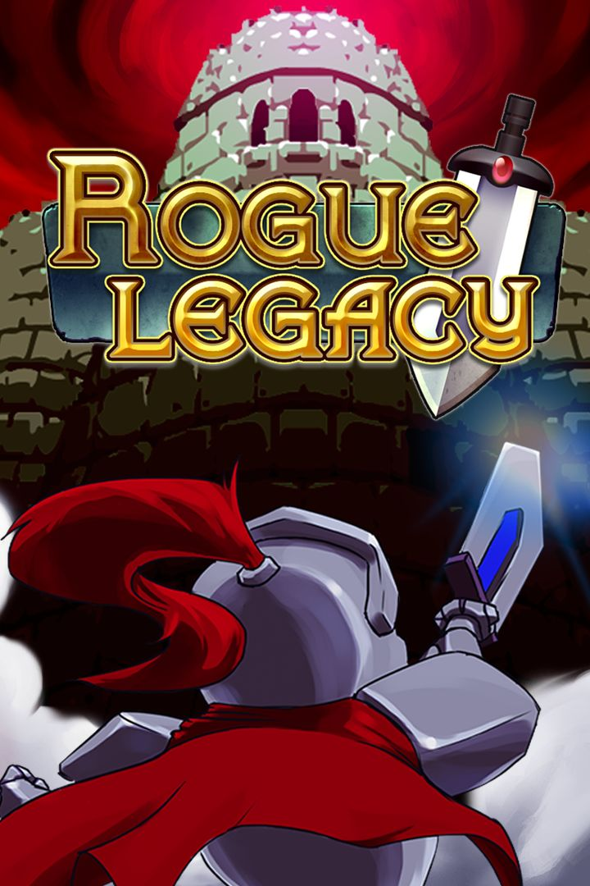
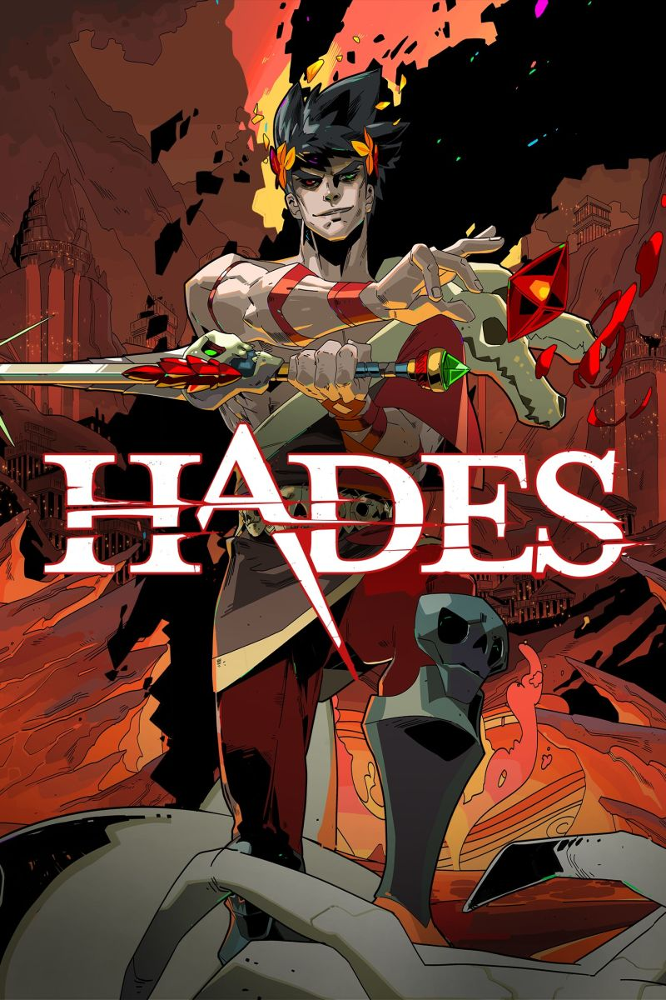

# Video games

### Some of the best Roguelikes according to me (2022):

1. Nuclear Throne (2015)



2. Enter the Gungeon (2016)


3. Celeste (2018)


4. Slay the Spire (2019)



5. Rogue Legacy (2013)



6. Risk Of Rain 2 (2019)


7. Hades (2018)



8. Dead Cells (2018)


## Other apparently decent roguelikes:
```
Darkest Dungeon
Dicey Dungeon
Spelunky / Spelunky 2
FTL: Faster than Light
Monster Train
Vampire Survivors
```


