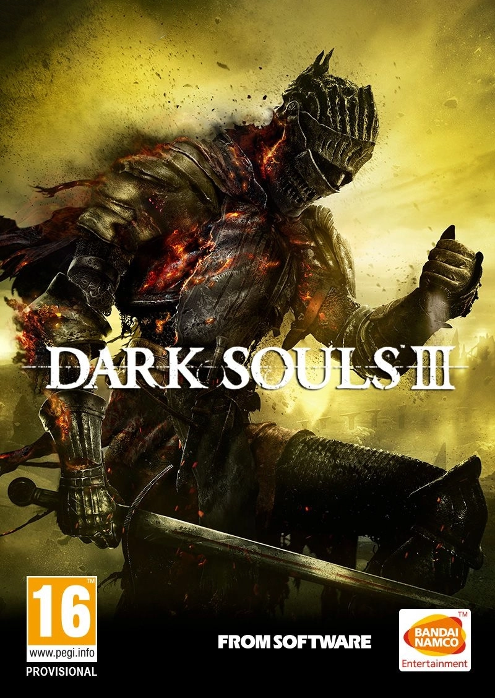
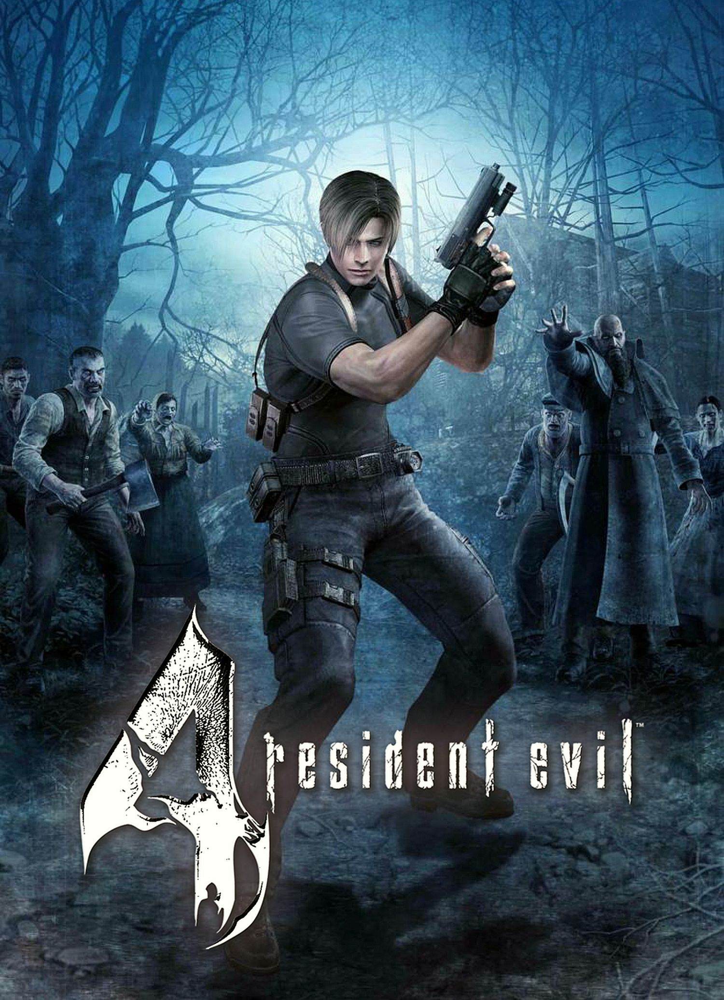
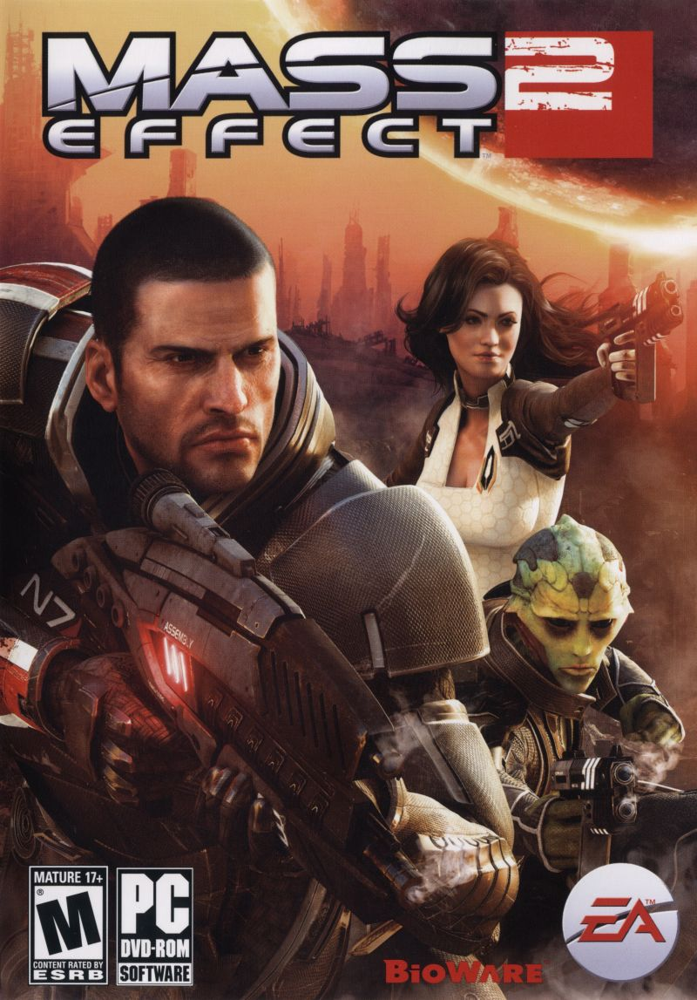
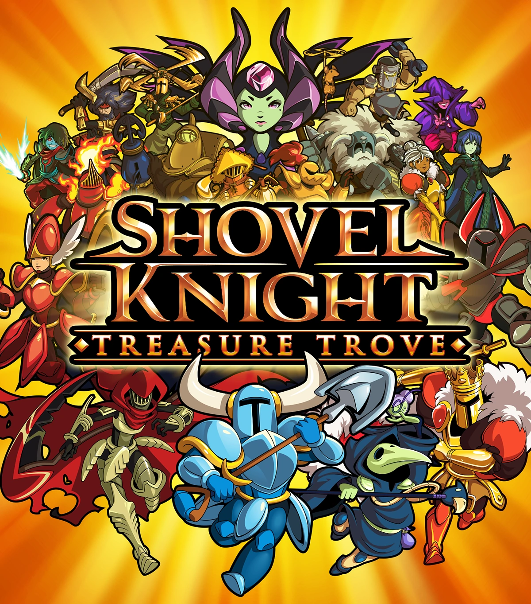

# Video games

### My top 10 video games that I've personally completed:

1. Elden ring (2022)


2. Final Fantasy X (2001)
   


3. Dark souls 3 (2016)




4. Enter the Gungeon (2016)
   


5. Call of Duty: Modern Warfare 2 (multiplayer, 2009)


6. Slay the Spire (2019)


7. Resident Evil 4 (2005)



8. Mass Effect 2 (2010)



9. Final Fantasy Tactics: The War of the Lions (2007)


10. Shovel Knight (2014)




Honorable mentions:
```
The Elder Scrolls IV: Oblivion (2006)
GTA: Vice City (2002)
Celeste (2018)
Borderlands 3 (2019)
Fallout 3 (2008)
Disgaea: hour of darkness (2003)
Nuclear Throne (2015)
Sekiro: Shadows Die Twice (2019)
```

Games I'd like to play one day:
```
The Elder Scrolls V: Skyrim (2011)
The Legend of Zelda: Breath of the Wild (2017)
GTA: San Andreas, GTA 4, GTA V (unsure which one is best)
Bloodborne (2015) + 
Basically any FromSoftware game from Dark Souls onwards.
```


### Video games I've played:

[Video games I've played](https://www.grouvee.com/user/136979-Exirr/shelves/)


